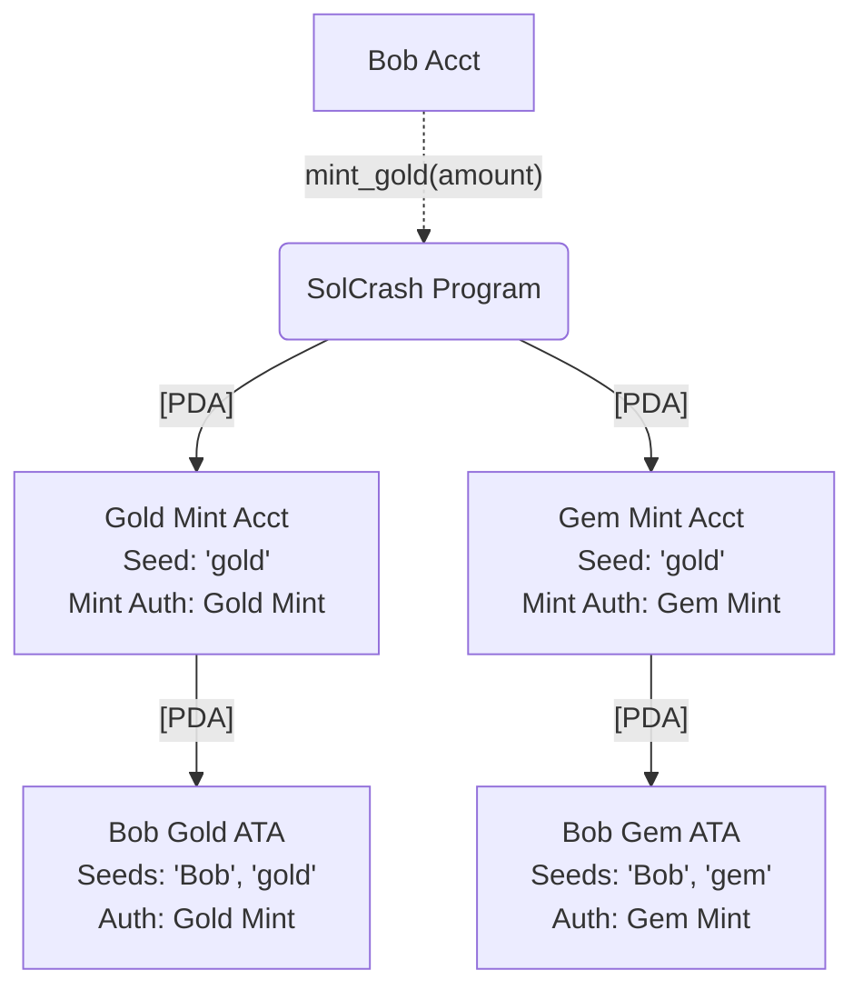

# Testing
Following solution from [stackexchange](https://solana.stackexchange.com/questions/8088/how-to-run-only-one-test-in-anchor-0-29-0):

>The command `anchor test` does three things:  
>1. Builds the program.  
>1. Deploys the program, spinning the localnet validator if needed.  
>1. Runs the test script.  
>
>Running `anchor run script` only does step 3 and so requires you to have run the `anchor build` and `anchor deploy` commands beforehand.  
>If you're testing on localnet it also requires that you spin up a test validator between the build and deploy steps and keep it active while you run your script.
>
>The solution to this is running `anchor localnet` to perform the build, start-validator, and deploy steps before you run your script.
  
Tests (WIP):
* Contract deployment.
* Gold operations.
* Gem operations.

# Deployment
All tokens are (for now) meant to be under control of the token program.
We are modeling a closed-loop economy. We can revisit later as an open-loop economy.

